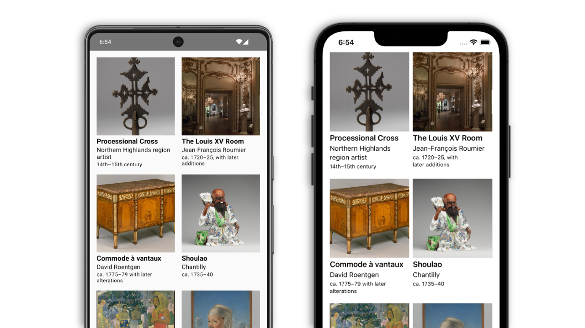

# Kotlin Multiplatform app template

This is a basic Kotlin Multiplatform app template for Android, iOS, desktop, and web. It includes shared business logic and data handling, and native UI implementations using Compose Multiplatform, SwiftUI, and React.

> The template is also available [with shared UI written in Compose Multiplatform](https://github.com/kotlin/KMP-App-Template).
>
> The [`kotlin-toolchain` branch](https://github.com/Kotlin/KMP-App-Template-Native/tree/kotlin-toolchain) showcases the same project configured with the [Kotlin Toolchain](https://github.com/JetBrains/kotlin-toolchain).

### Technologies

The data displayed by the app is from [The Metropolitan Museum of Art Collection API](https://metmuseum.github.io/).

The app uses the following multiplatform dependencies in its implementation:

- [Ktor](https://ktor.io/) for networking
- [kotlinx.serialization](https://github.com/Kotlin/kotlinx.serialization) for JSON handling
- [Koin](https://github.com/InsertKoinIO/koin) for dependency injection
- [KMP-ObservableViewModel](https://github.com/rickclephas/KMP-ObservableViewModel) for shared ViewModel implementations in common code
- [KMP-NativeCoroutines](https://github.com/rickclephas/KMP-NativeCoroutines)

> These are just some of the possible libraries to use for these tasks with Kotlin Multiplatform, and their usage here isn't a strong recommendation for these specific libraries over the available alternatives. You can find a wide variety of curated multiplatform libraries in the [kmp-awesome](https://github.com/terrakok/kmp-awesome) repository.

The Android and desktop apps share these dependencies:

- [Compose Multiplatform](https://jb.gg/compose) for UI
- [Compose Navigation](https://www.jetbrains.com/help/kotlin-multiplatform-dev/compose-navigation-routing.html)
- [Coil](https://github.com/coil-kt/coil) for image loading

The web app is built with [React](https://react.dev/), [TypeScript](https://www.typescriptlang.org/), and [Vite](https://vite.dev/).

The iOS app is built with [SwiftUI](https://developer.apple.com/xcode/swiftui/).
