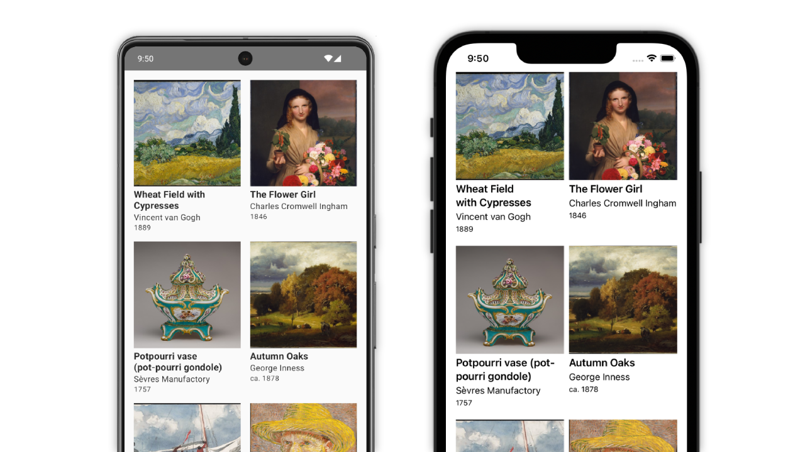

# Kotlin Multiplatform app template

This is a basic Kotlin Multiplatform app template for Android and iOS. It includes shared business logic and data handling, and native UI implementations using Jetpack Compose and SwiftUI.

> The template is also available [with shared UI written in Compose Multiplatform](https://github.com/kotlin/KMP-App-Template).

### Technologies

The data displayed by the app is from [The Metropolitan Museum of Art Collection API](https://metmuseum.github.io/).

The app uses the following multiplatform dependencies in its implementation:

- [Ktor](https://ktor.io/) for networking
- [kotlinx.serialization](https://github.com/Kotlin/kotlinx.serialization) for JSON handling
- [Koin](https://github.com/InsertKoinIO/koin) for dependency injection
- [SKIE](https://github.com/touchlab/SKIE) for smoother Swift interop
- [KMM-ViewModel](https://github.com/rickclephas/KMM-ViewModel) for shared ViewModel implementations in common code

> These are just some of the possible libraries to use for these tasks with Kotlin Multiplatform, and their usage here isn't a strong recommendation for these specific libraries over the available alternatives. You can find a wide variety of curated multiplatform libraries in the [kmp-awesome](https://github.com/terrakok/kmp-awesome) repository.

And the following Android-specific dependencies:

- [Jetpack Compose](https://developer.android.com/jetpack/compose)
- [Navigation component](https://developer.android.com/jetpack/compose/navigation)
- [Coil](https://github.com/coil-kt/coil) for image loading
